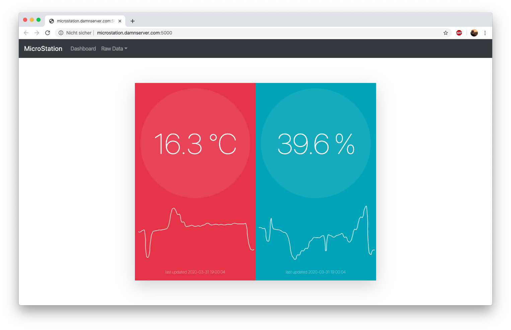
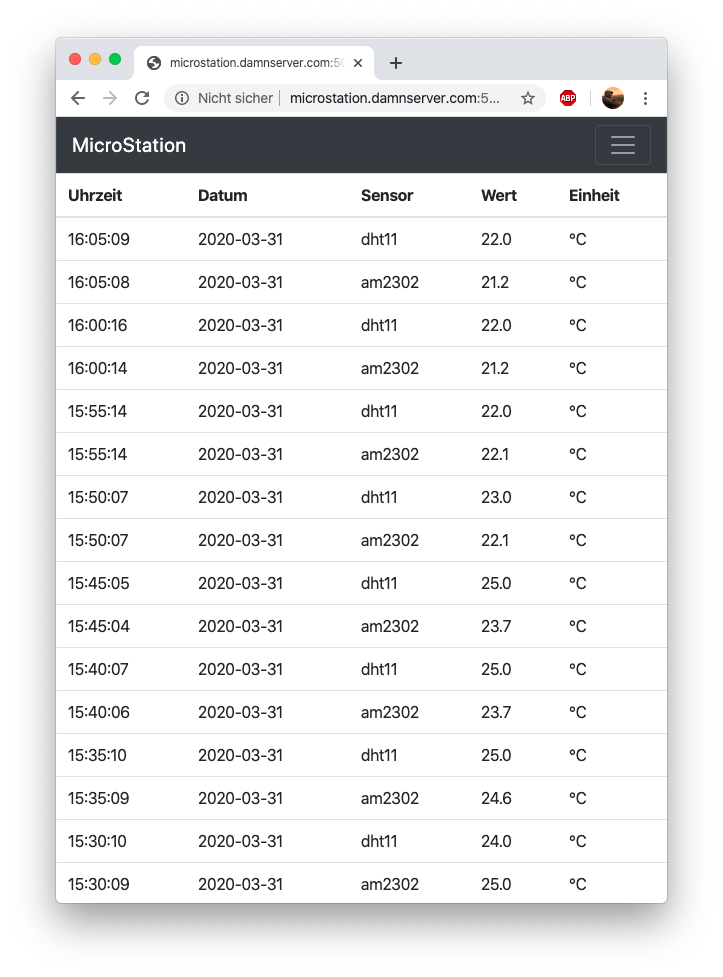

# MicroStation

## The idea

```
TODO
```

## About the Repo files

This repo contains some subprojects. Here is a short summary with the important information:


#### server

Code for the the python (flask) written webserver.

#### app

Code for the app.

##### station/pi

Code for the raspberryp pi as station with sensors

##### station/arduino 

Code for the esp8266 chip in wifi-controller.
Code for Arduino (Genuino) board in main-controller.

## About the Result

Take a look on some of the screenshots:


